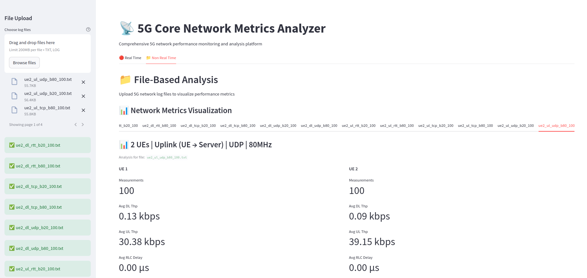

# 5G Core Network Metrics Analyzer

A Python web application for visualizing 5G core network metrics from log files.



## Features

- **Multi-file Support**: Upload and analyze multiple log files simultaneously
- **Interactive Visualizations**: Interactive plots for throughput, latency, data volume, delay, and PRB utilization
- **Tabbed Interface**: Each uploaded file gets its own tab for separate analysis
- **Data Export**: Download processed data as CSV files
- **Real-time Processing**: Uses the existing Perl script to parse log files

## Prerequisites

- Python 3.8 or higher
- Perl (for processing log files with script.pl)

## Installation

1. Install the required Python packages:

```bash
pip install -r requirements.txt
```

## Usage

1. Run the Streamlit application:

```bash
streamlit run app.py
```

2. Open your web browser and navigate to the URL shown in the terminal (typically `http://localhost:8501`)

3. Upload your 5G network log files using the sidebar file uploader

4. Analyze the visualized metrics in separate tabs for each file

## Log File Format

The application expects log files with KMP indication messages containing metrics like:

```
1 KPM ind_msg latency = 1748351985647759 [μs]
UE ID type = gNB, amf_ue_ngap_id = 1
ran_ue_id = 1
DRB.PdcpSduVolumeDL = 1355748 [kb]
DRB.PdcpSduVolumeUL = 11443 [kb]
DRB.RlcSduDelayDl = 6611.04 [μs]
DRB.UEThpDl = 1364419.02 [kbps]
DRB.UEThpUl = 12819.78 [kbps]
RRU.PrbTotDl = 2009726 [PRBs]
RRU.PrbTotUl = 92385 [PRBs]
```

## Supported Metrics

- **Latency**: KMP indication message latency
- **Throughput**: Downlink/Uplink user equipment throughput
- **Volume**: PDCP SDU data volumes
- **Delay**: RLC SDU delay
- **PRB**: Physical Resource Block utilization

## File Structure

- `app.py` - Main Streamlit application
- `script.pl` - Perl script for parsing log files
- `data.txt` - Sample log file
- `requirements.txt` - Python dependencies
- `README.md` - This file

## Testing

You can test the application with the provided `data.txt` sample file.

## Processing Pipeline

1. **Upload**: Users upload log files through the web interface
2. **Processing**: Files are processed using the Perl script (`script.pl`)
3. **Parsing**: CSV output is parsed into pandas DataFrames
4. **Visualization**: Interactive plots are generated using Plotly
5. **Export**: Processed data can be downloaded as CSV files
